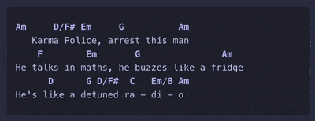
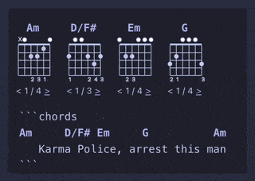
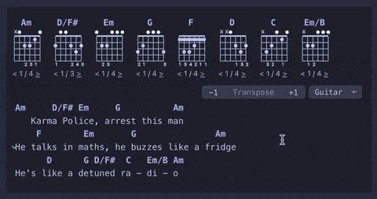
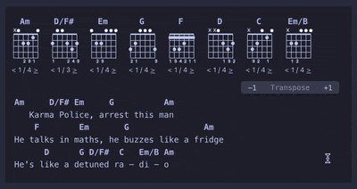
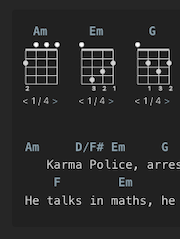
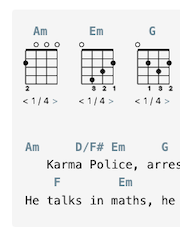
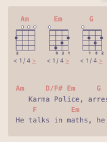
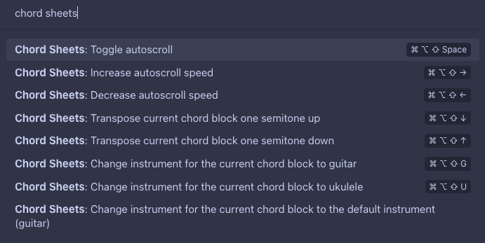

# Obsidian Chord Sheets

Render and work with chord sheets (**chords over lyrics**) in your vault. This plugin brings
UltimateGuitar-like functionality into Obsidian, featuring **chord diagrams**,
support for **guitar** and **ukulele**, **transposition**, and **autoscroll**. Works seamlessly in **edit / live preview**
and **reading** mode. It integrates with your **theme colors** and is **customizable** to your needs.

## Features

### ✨ Highlight Chord Symbols

Detects and highlights chord symbols in fenced code blocks marked as `"chord"`.


*Note:* When copy and pasting a chord sheet from a website, paste as plain text to preserve formatting. 

### 🎼 Chord Diagrams

Show chord diagrams on hover or on top of a chord block. Provides alternative fingerings for each chord. Diagrams are
rendered locally, no API calls to an external service required.





### 🎸 Choose Your Instrument

Supports guitar and ukulele for rendering the chord diagrams. Instrument can be set globally or specified per chord block.



### 📝 Seamless Editing

Allows seamless editing of chords and lyrics in *live preview / edit* mode while keeping chord symbol
highlighting and chord diagram rendering active, without needing to switch the fenced block to source view. This is
achieved by implementing a CodeMirror editor extension for rendering instead of a code block post processor.

### 🔄 Transpose Songs

Transpose songs up and down with a click or an editor command.



### 📜 Autoscroll

Scroll down as you play with configurable speed.


### 🌈 Uses Theme Colors

| Minimal dark                               | Minimal light                                 | AnuPpuccin light                                  |
|--------------------------------------------|------------------------------------------------|------------------------------------------------------|
|  |  |  |


### ⌨️ Editor Commands

Access all features using dedicated editor commands with support for keyboard shortcuts.



*Note*: The keyboard shortcuts in the screenshot are just for illustration. Shortcuts are empty by default 
and need to be set in Obsidian settings after installing the plugin. 

### 📱Mobile Support

Works well on mobile. Bring up chord diagram popups by tapping on the chord symbols.
Can be a bit fiddly in _edit / live preview_ mode because tapping on a chord will position the caret 
there which brings up the keyboard. Prefer _reading_ mode on mobile.

### ⚙️ Configurability

* Hide certain **UI elements** (instrument and transpose controls, chord diagrams, autoscroll button) for _edit / live preview_ mode, _reading_ mode, or both. 
* Adjust **chord diagram size** and the **default instrument** 
* Customize the block **"language" specifier** (e.g. start a chord block with ```` ```tab````  instead of ```` ```chords````)

## Development

- Clone this repo.
- `npm i` to install dependencies
- `npm run dev` to start compilation in watch mode.

This repo contains **run / debug configurations** for JetBrains IDEs (such as WebStorm). You will
need to adapt the _Run Obsidian_ configuration to the path of your Obsidian installation and set the 
working directory to the path where you cloned this repo.

To start a development and debug session with supports for breakpoints etc.:

1. Run the **Run Obsidian** configuration in **debug** mode. This will start Obsidian with the `--remote-debugging-port=9222` parameter which enables
Chrome remote debugging on port 9222.
2. Run the **Debug** configuration which attaches the IDE to Obsidian.
3. Run the **dev** configuration in **debug** mode which starts the development server.

## Manually installing the plugin

- Copy over `main.js`, `styles.css`, `manifest.json` to your vault `VaultFolder/.obsidian/plugins/chord-sheets/` and enable the plugin in Obsidian's settings.

## Credits

This plugin uses:

- [Vexchords](https://github.com/0xfe/vexchords) for rendering chord diagrams.
- [tonal](https://github.com/tonaljs/tonal) for parsing chord symbols, chord normalization and transposition.
- [chords-db](https://github.com/tombatossals/chords-db) for ukulele and guitar fingerings.

## Inspiration / Alternatives

- [Scales and Chords](https://github.com/egradman/scales-chords#readme)
	- Highlights chord symbols over lyrics in fenced code blocks
	- Shows chord diagrams on click that are fetched through an external web service
- [Obsidian Chord Lyrics](https://github.com/nevernotmove/obsidian-chordlyrics#readme)
	- Highlights chord symbols over lyrics in fenced code blocks
	- Maintains chord / lyrics relationships when line wrapping, good for reading chord sheets on your phone
- [Obsidian Markdown Chords](https://github.com/dnotes/obsidian-markdown-chords)
	- Renders chords in the ChordPro-inspired [*markdown-it-chords*](https://dnotes.github.io/markdown-it-chords/) (bracketed chords in lyrics) format in fenced code blocks
	- Optional rendering of chord diagrams above lyrics
	- Fingering needs to be specified explicitly as part of the chord symbol
- [Obsidian jTab](https://github.com/davfive/obsidian-jtab)
	- Renders tabs and chord diagrams in [*jTab*](https://jtab.tardate.com/) format in fenced code blocks 
